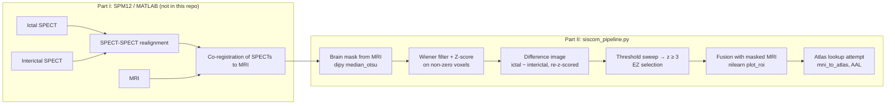

# SISCOM Epilepsy Localization

**A Python SISCOM pipeline (Subtraction Ictal SPECT Co-registered to MRI) that localizes the epileptogenic zone from ictal SPECT, interictal SPECT and MRI.**

    

## Overview

About a quarter of people with epilepsy have **drug-resistant (pharmacoresistant) epilepsy**. For many of them, surgery is the only effective treatment, and surgery only works if the **epileptogenic zone (EZ)**, the brain region where seizures start, is localized accurately.

**SISCOM** is a standard nuclear-medicine technique for this:

- A perfusion radiotracer (e.g. 99mTc-HMPAO or 99mTc-ECD) is injected *during* a seizure, giving an **ictal SPECT**.
- It is injected again during a seizure-free period, giving an **interictal SPECT**.
- After co-registration to the patient's **MRI**, the interictal scan is subtracted from the ictal scan. Regions that are hyperperfused during the seizure stand out, and the MRI shows the anatomy around them.

This repository holds Part II of a lab project for *Aplicacions Mèdiques de l'Enginyeria I* (Medical Applications of Engineering I), BSc in Biomedical Engineering, Universitat de Barcelona (December 2023). Part II is the image-processing and localization stage, implemented in Python. Part I, realigning the two SPECTs and co-registering them to the MRI, was done interactively in SPM12/MATLAB and is not part of this code.

## What I built

- **An end-to-end SISCOM script** (`siscom_pipeline.py`), converted from my original Colab notebook. It runs from the command line on three co-registered NIfTI volumes and writes every intermediate and final figure to disk.
- **MRI-based brain masking** with DIPY's `median_otsu`. The same mask is applied to the MRI and to both SPECTs, which removes background and out-of-brain noise before any intensity statistics are computed.
- **A comparison of intensity-normalization strategies** for the two SPECTs, each with a histogram so they can be compared:
  - Z-score
  - CDF (kept as a documented failed attempt)
  - Min-max
  - Z-score computed on non-zero (in-brain) voxels only
  - The final choice: Z-score on non-zero voxels after **Wiener filtering** (`scipy.signal.wiener`), to reduce Poisson noise
- **The ictal − interictal difference image**, re-standardized with a Z-score, plus code that finds the voxel with the maximum value and checks that every voxel with z > 4 clusters around it.
- **A threshold sweep** over z = 1.5 to 4.0 in steps of 0.5 to pick the EZ. The chosen threshold is z = 3, which isolates a single focus. A z = 2 map shows the wider hyperperfused region.
- **Fusion of the thresholded EZ with the masked MRI** (`nilearn.plotting.plot_roi`), for anatomical context.
- **An attempt at atlas labelling** with `mni_to_atlas` (AAL atlas), tried with three different coordinate conventions. This step did not succeed (see [Results](#results)), and the script keeps the failed attempts as documentation.

## Method



Let $I$ and $B$ be the masked ictal and interictal SPECT volumes, $W(\cdot)$ the Wiener filter, and $\mu_X^{\neq 0}$, $\sigma_X^{\neq 0}$ the mean and standard deviation of the non-zero voxels of $X$. Then

$$\tilde I = \frac{W(I) - \mu_I^{\neq 0}}{\sigma_I^{\neq 0}}, \qquad \tilde B = \frac{W(B) - \mu_B^{\neq 0}}{\sigma_B^{\neq 0}}, \qquad D = \mathrm{z}\big(\tilde I - \tilde B\big),$$

and the EZ map keeps the voxels where $D \ge 3$ and sets every other voxel to zero.

## Results

These results come from the project report (a one-page scientific poster) and the analysis notes kept in the script. Patient images are not included (see [Data](#data--privacy)).

- **EZ localized.** The maximum of the difference image is at array indices **(72, 104, 118)**, which the report gives as image coordinates **(x, y, z) = (33, 1, −75)**. All voxels with z > 4 lie around this point, so the report found no competing focus of similar magnitude.
- **Threshold.** A threshold of **z = 3** isolates the focus as a single region. z = 2 shows a wider area of high activity around the same focus.
- **Normalization.** Wiener filtering plus Z-score normalization on non-zero voxels was selected after comparison with plain Z-score, min-max and CDF normalization. The CDF variant did not behave as expected and was discarded.
- **Anatomical labelling: not achieved.** These are the attempts and how each failed:

  | Coordinates passed to `mni_to_atlas` (AAL) | Outcome |
  |---|---|
  | (33, 1, −75) used directly as MNI | Falls outside the brain (`Undefined`) |
  | (33, 1, −75) transformed with the image affine | Index out of bounds (dimension error) |
  | Indices (72, 104, 118) transformed with the affine | Falls outside the brain |

  The report attributes this most likely to the volumes not being **spatially normalized to MNI space**, which is required before MNI coordinates mean anything. The script also queries a point chosen by eye, (45, 15, −25), which AAL labels as the right superior temporal pole. That point is only an **illustration**; it is not a localization result.

## Limitations and next steps

- **Atlas labelling** would need spatial normalization to MNI space first, for example SPM12 Normalise applied to the MRI with the same warp applied to the EZ map.
- **Thresholding.** The EZ is chosen from a single maximum plus a global threshold. **Cluster-based thresholding**, which the report suggests, would be more robust.
- **Single subject.** This is a demonstration on one case, not a validated method.

## Tech stack

- Python 3
- NumPy and SciPy (`signal.wiener`)
- NiBabel (NIfTI I/O)
- nilearn (plotting, `image.coord_transform`)
- DIPY (`median_otsu`, `histeq`)
- matplotlib
- mni-to-atlas (AAL)
- SPM12 on MATLAB, used upstream for realignment and co-registration (Part I)

## Repository structure

```
SISCOM-Epilepsy-Localization/
├── siscom_pipeline.py   # Part II pipeline (comments and notebook notes translated to English)
├── requirements.txt
├── LICENSE
└── .gitignore           # excludes data/, figures/, *.nii, *.nii.gz
```

## Data & privacy

**The patient scans are not distributed.** They are clinical data provided for coursework. The `.gitignore` excludes `data/`, `figures/` and every NIfTI file so that neither the scans nor figures derived from them can be committed.

To run the pipeline, put three **co-registered NIfTI volumes of the same shape** in `data/`. The file names follow SPM12's `r` (realigned) and `c` (co-registered) prefixes:

| File | Content |
|---|---|
| `crICTAL.nii` | Ictal SPECT, realigned to the interictal SPECT and co-registered to the MRI |
| `cINTERICTAL.nii` | Interictal SPECT, co-registered to the MRI |
| `RM.nii` | T1 MRI ("RM" = *ressonància magnètica*) |

Two things in the script are tied to the original case:

- The display coordinates `(33, 1, -75)` and the slice index `z = 118`. With other data these only change which slices are plotted. The volumes need at least 119 slices along z.
- The hard-coded atlas-lookup coordinates. These document the original attempts and are not computed from the data.

## Getting started

```bash
git clone https://github.com/sergimarsol/SISCOM-Epilepsy-Localization.git
cd SISCOM-Epilepsy-Localization
python -m venv .venv && source .venv/bin/activate
pip install -r requirements.txt

# place crICTAL.nii, cINTERICTAL.nii and RM.nii in data/
python siscom_pipeline.py --data-dir data --out-dir figures

# headless / no GUI: suppress interactive windows
MPLBACKEND=Agg python siscom_pipeline.py --data-dir data --out-dir figures
```

The script prints the location of the maximum voxel and the voxels with z > 4. It writes about 20 PNGs to `--out-dir`, including:

- the masked inputs
- the normalization histograms
- the difference image (`diff.png`)
- the threshold sweep (`ZE_thresholds.png`)
- the EZ map (`ZE.png`)
- the MRI fusions (`fusion.png`, `fusion2.png`)

I checked that the script runs end to end on synthetic volumes; it takes about 1 minute on a laptop.

## Acknowledgements

- Solo project by **Sergi Marsol Torrent** for *Aplicacions Mèdiques de l'Enginyeria I*, BSc Biomedical Engineering, Universitat de Barcelona (lab 7, "Multimodal imaging techniques in epilepsy"), supervised by **Dr. Aida Niñerola** (Nuclear Medicine, Hospital Clínic de Barcelona).
- The images were provided by the course.
- SISCOM: O'Brien et al., *Nucl Med Commun* 19:31–45, 1998.
- Wiener filtering for nuclear medicine: King et al., *Med Phys* 10(6):876–880, 1983.

## License

[MIT](LICENSE) © 2026 Sergi Marsol
